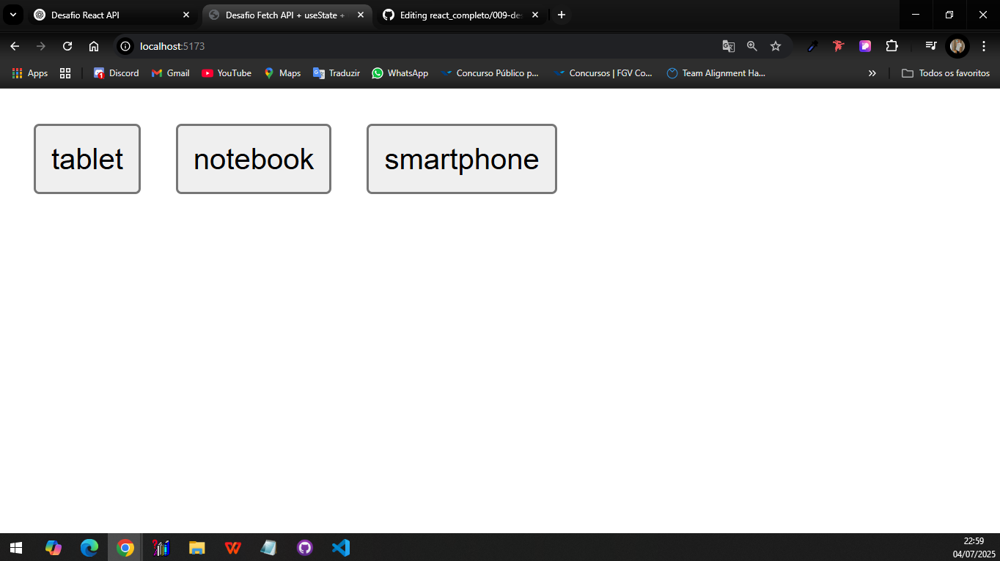
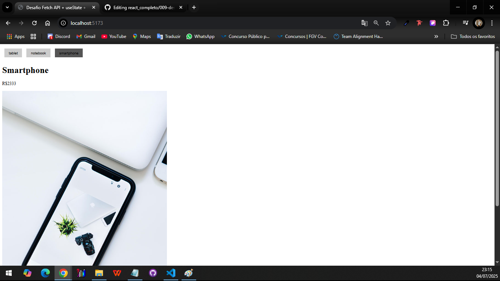

# Consumo de API com Fetch e useState - React

Este é um pequeno projeto React que consome a API de produtos da [Ranek API](https://ranekapi.origamid.dev/), exibindo os dados de um produto ao clicar em um dos botões disponíveis.

## 🔧 Tecnologias utilizadas

- React
- Fetch API
- Componentes funcionais
- useState

## 📦 Funcionalidades

- 3 botões para produtos: **tablet**, **notebook** e **smartphone**
- Requisição `fetch` para a API de produtos
- Exibe nome, preço e imagem do produto selecionado
- Mostra a mensagem **"Carregando..."** durante o fetch
- Componente separado para exibição dos dados (`Produto.jsx`)

## 📁 Estrutura do projeto
```
src/
├── App.jsx
├── Produto.jsx
```

## 🚀 Como usar

1. Clone o repositório
2. Instale as dependências com `npm install` ou `yarn`
3. Rode o projeto com `npm run dev` (caso esteja usando Vite)

## 📷 Preview




## 📝 Licença

Este projeto é apenas para fins educacionais.

