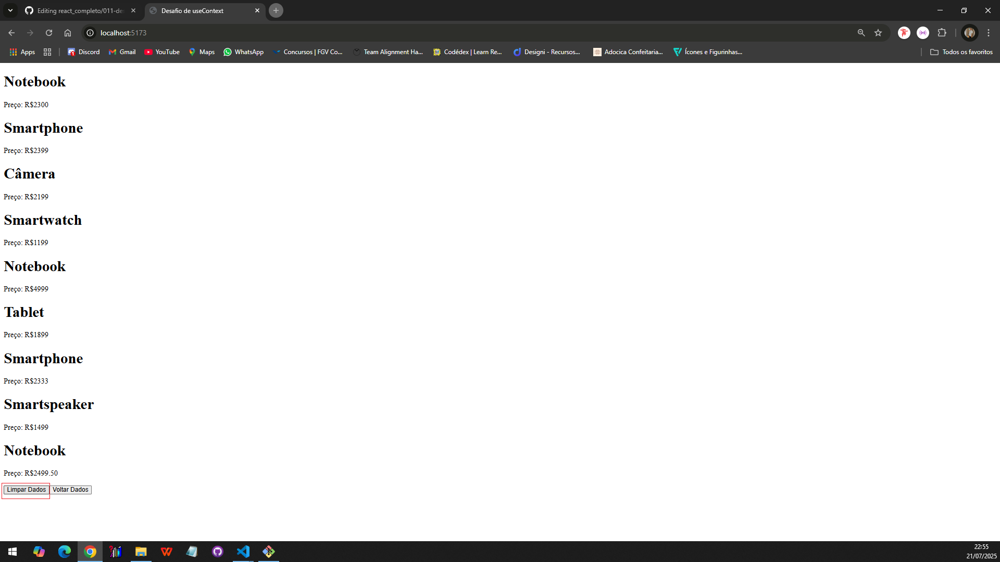

# 🧩 Desafio 011: useContext - React

Este é um projeto simples em React que utiliza o useContext para centralizar e compartilhar dados de uma API entre componentes. Ao carregar o app, os produtos são buscados automaticamente da Ranek API e disponibilizados globalmente via contexto.

## 🔧 Tecnologias utilizadas

- React
- Fetch API
- Componentes funcionais
- useState
- useEffect
- useContext
- Context API

## 📦 Funcionalidades

- Busca automática dos produtos da API ao iniciar o app
- Armazena os dados no contexto global
- Botão "Limpar Dados" para limpar os dados da tela
- Botão "Voltar Dados" para restaurar os dados via API
- Renderização condicional com mensagem quando não há dados
- Organização em componentes reutilizáveis

## 📁 Estrutura do projeto
```
src/
├── App.jsx
├── Produto.jsx
├── ContextoGlobal.jsx
```

## 🚀 Como usar

1. Clone o repositório
2. Instale as dependências com `npm install` ou `yarn`
3. Rode o projeto com `npm run dev` (caso esteja usando Vite)
4. Acesse http://localhost:5173 no navegador

## 📷 Preview




## 📝 Licença

Este projeto é apenas para fins educacionais.

